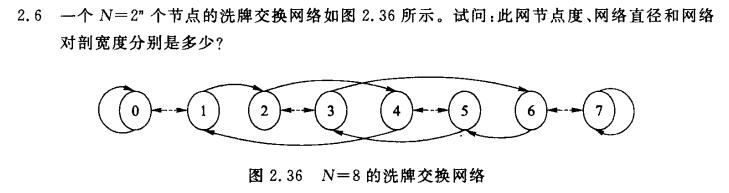
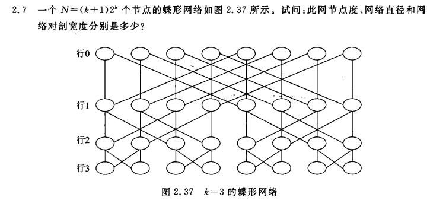
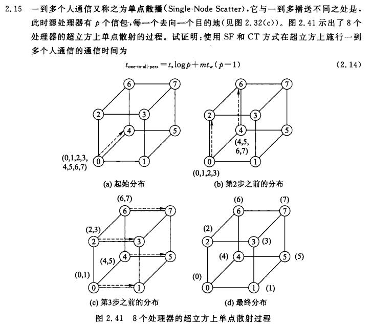

## HW4
**PB20000215 丁程**

**Ex2.6**

节点度：4
网络直径：5
网络对剖宽度：4

**Ex2.7**

节点度：2和4
网络直径：6
网络对剖宽度：8

**Ex2.15**


$t_{comm}(SF)=t_s+(m_it_w+t_h)l$
$t_{comm}(CT)=t_s+m_it_w+t_hl$

每次传播只经过一条链路，因此 $l=1$，忽略 $t_h$可得：

$t_{comm}(SF)=t_s+m_it_w$
$t_{comm}(CT)=t_s+m_it_w$

一开始有p个信包，每次播送一半，因此：

$m_i = pm/2^i$

所以

$t(SF)=t(CT)=t_{one-to-all-pers}=\Sigma_{i=1}^{logp}t_i = t_s logp + mt_w(p-1)$

## HW5


**Ex9.S1**
PRAM-EREW上Cannon分块算法
```
for all Pi,j par-do 
    Ci,j = 0 
endfor 
for k = 0 to sqrt(p) - 1 do 
    for all Pi,j par-do 
        Ci,j = Ci,j + Ai,(i+j+k)modsqrt(p) * B(i+j+k)modsqrt(p),j 
    endfor
endfor
```
时间复杂度：
$O(\sqrt{p} * (n/\sqrt{p})^3) = O(n^3/p)$

**Ex9.9**
```
算法9.7 ＰＲＡＭ－ＣＲＥＷ上矩阵相乘算法 
输入： Ａｎ× ｎ ，Ｂｎ×ｎ 
输出： Ｃｎ× ｎ 
Begin
(1) 将n^2个处理器组织成ｎ×ｎ的网孔 
(2) for each Pi,j do
    (2.1) ci,j＝０ 
    (2.2) for k=0 to n-1 do
            ci,j = ci,j + ai,k * bk,j 
          end for 
    end for 
end
```
(1) $t_1 = t_a$
(2) $t_2 = n * (t_c + 4t_a)$ (读a，读b，读c，写c，四次读写)
总并行时间:
$t = t_1 + t_2 = (4n+1)t_a + nt_c$