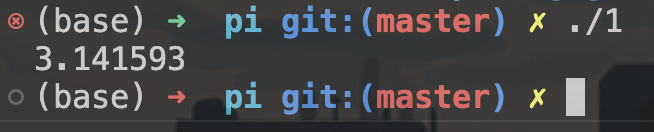
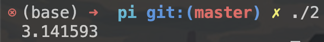
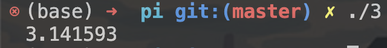
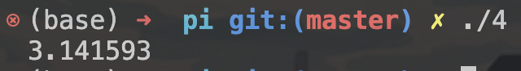
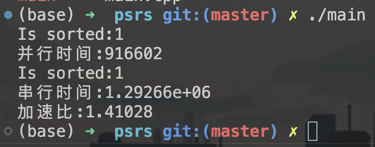

## 并行计算 Lab1 实验报告

**PB20000215 丁程**

### part1
本部分为基于OpenMP使用四种不同的并行算法计算pi的值
1、使用并行域并行化的程序
```C
#include <stdio.h>
#include <omp.h>
static long num_steps = 100000;
double step;
#define NUM_THREADS 2
void main ()
{ 
	int i;
	double x, pi, sum[NUM_THREADS];
	step = 1.0/(double) num_steps;
	omp_set_num_threads(NUM_THREADS);  //设置2线程
 #pragma omp parallel private(i)  //并行域开始，每个线程(0和1)都会执行该代码
{
	double x;
	int id;
	id = omp_get_thread_num();
	for (i=id, sum[id]=0.0;i< num_steps; i=i+NUM_THREADS){
		x = (i+0.5)*step;
		sum[id] += 4.0/(1.0+x*x);
	}
}
	for(i=0, pi=0.0;i<NUM_THREADS;i++)  pi += sum[i] * step;
	printf("%lf\n",pi);
 }
```
2、使用共享任务结构并行化的程序
```C
#include <stdio.h>
#include <omp.h>
static long num_steps = 100000;
double step;
#define NUM_THREADS 2
void main ()
{ 
	int i;
	double x, pi, sum[NUM_THREADS];
	step = 1.0/(double) num_steps;
	omp_set_num_threads(NUM_THREADS);  //设置2线程
 #pragma omp parallel  //并行域开始，每个线程(0和1)都会执行该代码
{
	double x;
	int id;
	id = omp_get_thread_num();
	sum[id]=0;
#pragma omp for  //未指定chunk，迭代平均分配给各线程（0和1），连续划分
	for (i=0;i< num_steps; i++){
		x = (i+0.5)*step;
		sum[id] += 4.0/(1.0+x*x);
	}
}
	for(i=0, pi=0.0;i<NUM_THREADS;i++)  pi += sum[i] * step;
	printf("%lf\n",pi);
}//共2个线程参加计算，其中线程0进行迭代步0~49999，线程1进行迭代步50000~99999.
```

3、使用private子句和critical部分并行化的程序
```C
#include <stdio.h>
#include <omp.h>
static long num_steps = 100000;
double step;
#define NUM_THREADS 2
void main ()
{ 
	int i;
    int id;
	double pi=0.0;
	double sum=0.0;
	double x=0.0;
	step = 1.0/(double) num_steps;
	omp_set_num_threads(NUM_THREADS);  //设置2线程
#pragma omp parallel private(id,i,x,sum) //该子句表示x,sum变量对于每个线程是私有的
{
	id = omp_get_thread_num();
	for (i=id, sum=0.0;i< num_steps; i=i+NUM_THREADS){
		x = (i+0.5)*step;
		sum += 4.0/(1.0+x*x);
	}
#pragma omp critical  //指定代码段在同一时刻只能由一个线程进行执行
	pi += sum*step;
}
	printf("%lf\n",pi);
}	//共2个线程参加计算，其中线程0进行迭代步0,2,4,...线程1进行迭代步1,3,5,....当被指定为critical的代码段	正在被0线程执行时，1线程的执行也到达该代码段，则它将被阻塞知道0线程退出临界区。
```

4、使用并行规约的并行程序
```C
#include <stdio.h>
#include <omp.h>
static long num_steps = 100000;
double step;
#define NUM_THREADS 2
void main ()
{ 
	int i;
	double pi=0.0;
	double sum=0.0;
	double x=0.0;
	step = 1.0/(double) num_steps;
	omp_set_num_threads(NUM_THREADS);  //设置2线程
#pragma omp parallel for reduction(+:sum) private(x) //每个线程保留一份私有拷贝sum，x为线程私有，最后对线程中所以sum进行+规约，并更新sum的全局值
	for(i=1;i<= num_steps; i++){
		x = (i-0.5)*step;
		sum += 4.0/(1.0+x*x);
	}
	pi = sum * step;
	printf("%lf\n",pi);
}	//共2个线程参加计算，其中线程0进行迭代步0~49999，线程1进行迭代步50000~99999.
```
其中程序1、2、4直接使用PPT上代码即可。
程序3需要对PPT的代码进行一些修改，将全局的int i变为每个线程私有的即可。
运行结果如下：
1、

2、

3、

4、

可以看出，四个计算pi值的并行算法代码均得到了正确的结果。

### part2
本部分为编写基于OpenMP的PSRS排序代码
PSRS并行排序算法分为以下几个部分：
```
(1)均匀划分：将n个元素A[1..n]均匀划分成p段，每个pi处理A[(i-1)n/p+1..in/p]
(2)局部排序：pi调用串行排序算法对A[(i-1)n/p+1..in/p]排序
(3)选取样本：pi从其有序子序列A[(i-1)n/p+1..in/p]中选取p个样本元素
(4)样本排序：用一台处理器对p2个样本元素进行串行排序
(5)选择主元：用一台处理器从排好序的样本序列中选取p-1个主元，并播送给其他pi
(6)主元划分：pi按主元将有序段A[(i-1)n/p+1..in/p]划分成p段
(7)全局交换：各处理器将其有序段按段号交换到对应的处理器中
(8)归并排序：各处理器对接收到的元素进行归并排序
```
这里对编写的C++代码进行解释：
首先第一部分均匀划分，按照下标将数组分配给各个处理器即可。
之后每个处理器使用库函数std::sort进行排序并选取样本：
```cpp
#pragma omp parallel
    {
        int id = omp_get_thread_num();
        std::sort(array.begin() + id * range, array.begin() + (id + 1) * range);    //局部排序
        for(int i = 0; i < NUM_THREADS; i++) {
            sample[id * NUM_THREADS + i] = array[id * range + i * range / NUM_THREADS];  //每个线程选取p个样本元素
        }
    }   
```
然后对p^2个样本再次调用std::sort进行样本排序：
```cpp
std::sort(sample, sample + NUM_THREADS * NUM_THREADS);  //对样本元素进行排序
```
之后选取p-1个主元，并根据这p-1个主元将每个处理器单独的有序段划分为p段：
```cpp
int pivot[NUM_THREADS - 1];  //选取p-1个主元
    for(int i = 0; i < NUM_THREADS - 1; i++) {
        pivot[i] = sample[(i + 1) * NUM_THREADS];
    }
    
    #pragma omp parallel
    {   //主元划分
        int id = omp_get_thread_num();
        int start = id * range;
        int end = (id + 1) * range;
        for (int i = start; i < end; i++){
            int j = 0;
            
            while (j < NUM_THREADS - 1) {
                if (array[i] <= pivot[j]) {
                    break;
                }
                j++;
            }
            swap_map[i] = j;
        }
    }
```
再之后是全局交换部分，将划分完的有序段对应分到处理器：
```cpp
int count[NUM_THREADS] = {0};
    
    for (int i = 0; i < length; i++){  //统计每个段的元素个数
        count[swap_map[i]]++;
    }
    
    int offset[NUM_THREADS] = {0};
    offset[0] = 0;
    for(int i = 1; i < NUM_THREADS; i++){  //计算每个段的起始位置
        offset[i] = offset[i-1] + count[i-1];
    }
    
    std::vector<int> temp(array);
    int cnt[NUM_THREADS] = {0};
    
    for(int i = 0; i < length; i++){  //根据map进行交换
        array[offset[swap_map[i]] + cnt[swap_map[i]]] = temp[i];
        cnt[swap_map[i]]++;
    }
```
最后每个处理器对分配到的元素进行局部排序：
```cpp
#pragma omp parallel
    { 
        int id = omp_get_thread_num();
        if(id != NUM_THREADS - 1)
            std::sort(array.begin() + offset[id], array.begin() + offset[id+1]);    //局部排序
        else
            std::sort(array.begin() + offset[id], array.end());    //局部排序
    }
```
之后在main函数中调用排序函数，使用库函数is_sorted判断排序是否正确，使用std::chrono库进行计时，将其与串行排序算法std::sort进行比较计算加速比：
```cpp
int main(int argc, char* argv[]) {
    srand(static_cast<unsigned int>(time(NULL)));
    std::vector<int> arr(TEST_SIZE);
    for (int i = 0; i < TEST_SIZE; i++) {
        arr[i] = static_cast<int>(RandomGenerateNumber());
    }
    
    auto start = std::chrono::system_clock::now();
    PSRS_Sort(arr, TEST_SIZE);
    auto end = std::chrono::system_clock::now();
    std::cout << "Is sorted:" << bool(is_sorted(arr.begin(), arr.end())) << std::endl;
    auto duration = duration_cast<std::chrono::microseconds>(end - start);
    std::cout << "并行时间:" << double(duration.count()) * std::chrono::microseconds::period::num << std::endl;
    
    for (int i = 0; i < TEST_SIZE; i++) {
        arr[i] = static_cast<int>(RandomGenerateNumber());
    }
    auto start1 = std::chrono::system_clock::now();
    std::sort(arr.begin(), arr.end());
    auto end1 = std::chrono::system_clock::now();
    std::cout << "Is sorted:" << bool(is_sorted(arr.begin(), arr.end())) << std::endl;
    auto duration1 = duration_cast<std::chrono::microseconds>(end1 - start1);
    std::cout << "串行时间:" << double(duration1.count()) * std::chrono::microseconds::period::num << std::endl;

    std::cout << "加速比:" << double(duration1.count()) * std::chrono::microseconds::period::num / double(duration.count()) * std::chrono::microseconds::period::num << std::endl;
    
    return 0;
}
```
运行结果如下：
TEST_SIZE为16000000，使用四个线程进行并行排序

可以看到排序结果正确，并行算法相对串行算法性能也有提升，加速比大于1。

至此，本实验结束。本次实验主要为OpenMP的应用，使用OpenMP编写不同的并行算法。经过本次实验，对OpenMP的应用以及并行算法有了更深的了解。