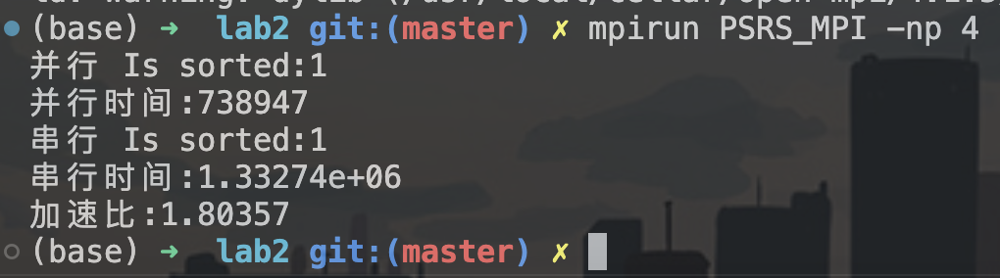
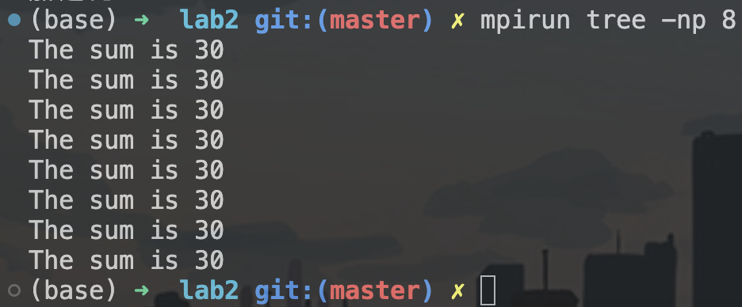
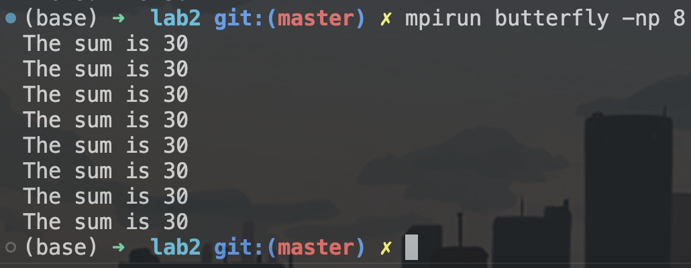

## 并行计算 Lab1 实验报告

**PB20000215 丁程**

### part1
本部分为使用MPI编写PSRS并行排序算法。
这里同样对编写的程序进行解释：
首先划分数组并进行局部排序，这里和OpenMP不太一样的一点是需要使用MPI_Scatter将数组分配到各个处理器中，然后调用std::sort进行排序，排完序后使用MPI_Gather收集各个处理器的结果汇总到全局。
```cpp
int* local_arr = (int*)malloc(range * sizeof(int));
MPI_Scatter(array, range, MPI_INT, local_arr, range, MPI_INT, 0, 
MPI_COMM_WORLD);
std::sort(local_arr, local_arr + range);
MPI_Gather(local_arr, range, MPI_INT, array, range, MPI_INT, 0, 
MPI_COMM_WORLD);
free(local_arr);
```
选取样本、样本排序和选择主元均发生在全局处，因此不需要MPI库函数做通信。
```cpp
int* pivot = (int*)malloc((num_procs - 1) * sizeof(int));
    
    // 选取样本
    if (id == 0) {
        int* sample = (int*)malloc(num_procs * num_procs * sizeof(int));
        for (int i = 0; i < num_procs * num_procs; ++i) {
            sample[i] = array[i * range / num_procs];
        }

        // 样本排序
        std::sort(sample, sample + num_procs * num_procs);

        // 选择主元
        for (int i = 0; i < num_procs - 1; ++i) {
            pivot[i] = sample[(i + 1) * num_procs];
        }
        free(sample);
    }
```
之后使用MPI_Bcast将划分好的主元广播到各个处理器处，然后各个处理器根据主元对排完序的有序段进行划分：
```cpp
MPI_Bcast(pivot, num_procs - 1, MPI_INT, 0, MPI_COMM_WORLD);    // 广播主元
    
    // 主元划分
    MPI_Bcast(array, TEST_SIZE, MPI_INT, 0, MPI_COMM_WORLD);
    int* swap_map = (int*)malloc(range * sizeof(int));
    for (int i = 0; i < range; ++i) {
        int j = 0;
        while (j < num_procs - 1) {
                if (array[id * range + i] <= pivot[j]) {
                    break;
                }
                j++;
            }
        swap_map[i] = j;
    }
```
然后用MPI_Gather收集每个处理器的划分结果，根据划分结果进行全局交换：
```cpp
int* swap = (int*)malloc(TEST_SIZE * sizeof(int));
    MPI_Gather(swap_map, range, MPI_INT, swap, range, MPI_INT, 0, MPI_COMM_WORLD);
    int* count = (int*)malloc(num_procs * sizeof(int));
    for (size_t i = 0; i < num_procs; i++){
        count[i] = 0;
    }
    
    int* offset = (int*)malloc(num_procs * sizeof(int));
    free(swap_map);
    // 全局交换
    
    if (id == 0) {
        
        for (int i = 0; i < TEST_SIZE; i++){  //统计每个段的元素个数
            count[swap[i]]++;
        }
        
        offset[0] = 0;
        for(int i = 1; i < num_procs; i++){  //计算每个段的起始位置
            offset[i] = offset[i-1] + count[i-1];
        }
        
        int* temp = (int*)malloc(TEST_SIZE * sizeof(int));
        for (int i = 0; i < TEST_SIZE; i++){
            temp[i] = array[i];
        }
        int* cnt = (int*)malloc(num_procs * sizeof(int));
        for(int i = 0; i < num_procs; i++){  //初始化计数器
            cnt[i] = 0;
        }
        
        for(int i = 0; i < TEST_SIZE; i++){  //根据map进行交换
            array[offset[swap[i]] + cnt[swap[i]]] = temp[i];
            cnt[swap[i]]++;
        }
        
    }
```
之后再将结果使用MPI_Bcast广播到各个处理器处，各个处理器分别进行局部排序，排完序的结果使用MPI_Send发送到全局处，即对整个数组完成排序：
```cpp
// 归并排序
    MPI_Bcast(offset, num_procs, MPI_INT, 0, MPI_COMM_WORLD);
    MPI_Bcast(count, num_procs, MPI_INT, 0, MPI_COMM_WORLD);
    MPI_Bcast(array, TEST_SIZE, MPI_INT, 0, MPI_COMM_WORLD);

    if(id != num_procs - 1)
        std::sort(array + offset[id], array + offset[id+1]);
    else{
        std::sort(array + offset[id], array + TEST_SIZE);
    }

    if (id != 0) {
        MPI_Send(array + offset[id], count[id], MPI_INT, 0, 0, 
        MPI_COMM_WORLD);
    } else {
        for (int i = 1; i < num_procs; ++i) {
            MPI_Recv(array + offset[i], count[i], MPI_INT, i, 0, 
            MPI_COMM_WORLD, MPI_STATUS_IGNORE);
        }
    }
```
然后依旧使用std::chrono库进行计时，将并行排序算法和串行std::sort进行比较：
```cpp
int main(int argc, char* argv[]) {
    int id, num_procs;  // 进程号和总进程数

    int* arr = (int*)malloc(TEST_SIZE * sizeof(int));
    for (int i = 0; i < TEST_SIZE; i++) {
        arr[i] = static_cast<int>(RandomGenerateNumber());
    }
    
    MPI_Init(&argc, &argv);
    MPI_Comm_rank(MPI_COMM_WORLD, &id);
    MPI_Comm_size(MPI_COMM_WORLD, &num_procs);
    srand(static_cast<unsigned int>(time(NULL)));
    auto start = std::chrono::system_clock::now();
    PSRS_Sort(arr, id, num_procs);
    auto end = std::chrono::system_clock::now();
    auto duration = duration_cast<std::chrono::microseconds>(end - start);
    if(id == 0){
        auto duration = duration_cast<std::chrono::microseconds>(end - start);
        std::cout << "并行 Is sorted:" << std::is_sorted(arr, arr + TEST_SIZE) << std::endl;
        std::cout << "并行时间:" << double(duration.count()) * std::chrono::microseconds::period::num << std::endl;
    }
    MPI_Barrier(MPI_COMM_WORLD);
    for (int i = 0; i < TEST_SIZE; i++) {
        arr[i] = static_cast<int>(RandomGenerateNumber());
    }
    if(id == 0){
        auto start1 = std::chrono::system_clock::now();
        std::sort(arr, arr + TEST_SIZE);
        auto end1 = std::chrono::system_clock::now();
        std::cout << "串行 Is sorted:" << std::is_sorted(arr, arr + TEST_SIZE) << std::endl;
        auto duration1 = duration_cast<std::chrono::microseconds>(end1 - start1);
        std::cout << "串行时间:" << double(duration1.count()) * std::chrono::microseconds::period::num << std::endl;
        std::cout << "加速比:" << double(duration1.count()) / double(duration.count()) << std::endl;
    }
    MPI_Finalize();
    free(arr);
    return 0;
}
```
这里在main函数中，需要使用
```cpp
MPI_Init(&argc, &argv);
MPI_Comm_rank(MPI_COMM_WORLD, &id);
MPI_Comm_size(MPI_COMM_WORLD, &num_procs);
```
对线程数和id进行初始化，以进行后续的并行化。
程序运行结果如下：
使用
```bash
mpic++ PSRS_MPI.cpp -O2 -o PSRS_MPI -std=c++2a
```
进行编译，之后使用
```bash
mpirun PSRS_MPI -np 4
```
运行编译完成的并行程序，结果如下：


### part2
本部分为使用MPI用树形和蝶形两种方式求全和，要求每个处理器均保持全和。
树形方式求全和的代码如下：
```cpp
#include <mpi.h>
#include <iostream>
int A[8] = {7, 4, 3, 2, 5, 3, 2, 4};
int main(int argc, char* argv[]) {
    MPI_Init(&argc, &argv);

    int id, num_procs;
    MPI_Comm_rank(MPI_COMM_WORLD, &id);
    MPI_Comm_size(MPI_COMM_WORLD, &num_procs);

    int sum = A[id];
    int temp_sum = 0;

    for (int i = 1; i < num_procs; i *= 2) {
        if (id % (2 * i) == 0) {
            if (id + i < num_procs) {
                MPI_Recv(&temp_sum, 1, MPI_INT, id + i, 0, MPI_COMM_WORLD, MPI_STATUS_IGNORE);
                sum += temp_sum;
            }
        } else {
            MPI_Send(&sum, 1, MPI_INT, id - i, 0, MPI_COMM_WORLD);
            break;
        }
    }

    MPI_Bcast(&sum, 1, MPI_INT, 0, MPI_COMM_WORLD);
    
    if(id == 0 || id == 1 || id == 2 || id == 3 ||
    id == 4 || id == 5 || id == 6 || id == 7)
        std::cout << "The sum is " << sum << std::endl;

    MPI_Finalize();
    return 0;
}
```
在初始化完之后，沿着树自下向上传播自身的值，每一个父节点收到子节点的值后和自身的值做加法，然后再向上传递给父节点，依次进行。直到根节点收到其子节点的值后，将计算得到的全和使用MPI_Bcast传播给所有其他处理器，这样所有处理器均保持了全和。
然后在最后，让每个处理器均打印一遍全和，以确认每个处理器均保持全和。
代码运行结果如下：
使用
```bash
mpic++ tree.cpp -O2 -o tree
```
进行编译，之后使用
```bash
mpirun tree -np 8
```
运行编译完成的并行程序，结果如下：

可以看到，每个处理器均保持了全和。

蝶形方式求全和的代码如下：
```cpp
#include <mpi.h>
#include <iostream>
int A[8] = {7, 4, 3, 2, 5, 3, 2, 4};
int main(int argc, char* argv[]) {
    MPI_Init(&argc, &argv);

    int id, num_procs;
    MPI_Comm_rank(MPI_COMM_WORLD, &id);
    MPI_Comm_size(MPI_COMM_WORLD, &num_procs);

    int sum = A[id];
    int temp_sum = 0;

    for (int i = 1; i < num_procs; i *= 2) {
        if (id < (id ^ i)) {
            MPI_Send(&sum, 1, MPI_INT, id ^ i, 0, MPI_COMM_WORLD);
            MPI_Recv(&temp_sum, 1, MPI_INT, id ^ i, 0, MPI_COMM_WORLD, MPI_STATUS_IGNORE);
        } else {
            MPI_Recv(&temp_sum, 1, MPI_INT, id ^ i, 0, MPI_COMM_WORLD, MPI_STATUS_IGNORE);
            MPI_Send(&sum, 1, MPI_INT, id ^ i, 0, MPI_COMM_WORLD);
        }
        sum += temp_sum;
    }

    if(id == 0 || id == 1 || id == 2 || id == 3 ||
    id == 4 || id == 5 || id == 6 || id == 7)
        std::cout << "The sum is " << sum << std::endl;
    

    MPI_Finalize();
    return 0;
}
```
这里使用位运算来计算需要传递消息的对应id
首先第一轮分为四组，分别为01，23，45，67
二进制表示分别为000,001,...,111
第一轮的i为1
0的二进制表示为000，将其与1做按位异或即可得到001
其他同理，每一组与1做按位异或后可以得到组中另一个处理器的id

第二轮传递顺序为：
0 -> 2
1 -> 3
2 -> 0
3 -> 1
4 -> 6
5 -> 7
6 -> 4
7 -> 5
将每个id与2做按位异或即可。

第三轮传递顺序为：
0 -> 4
1 -> 5
2 -> 6
3 -> 7
4 -> 0
5 -> 1
6 -> 2
7 -> 3
将每个id与4做按位异或即可。
由此可以写出上述蝶形求全和的传递代码，按这种方式传递三轮之后可以做到所有处理器均保持全和。
在最后也是让所有处理器都打印了一遍全和。
代码运行结果如下：
使用
```bash
mpic++ butterfly.cpp -O2 -o butterfly
```
进行编译，之后使用
```bash
mpirun butterfly -np 8
```
运行编译完成的并行程序，结果如下：

可以看到，每个处理器均保持了全和。

至此，本次实验结束。
本次实验主要内容是使用MPI完成PSRS并行排序算法和树形、蝶形求全和，经过本次实验，对MPI和各种并行算法有了更深入的了解。
