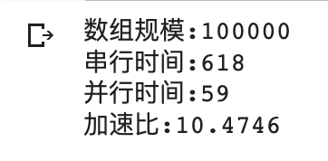
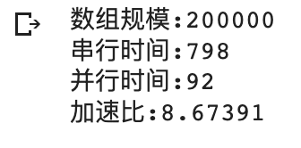
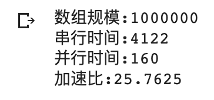
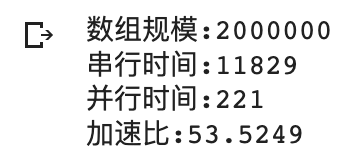
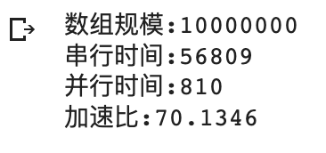
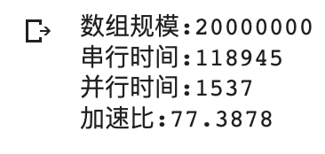
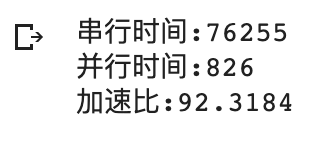

## 并行计算 Lab3 实验报告

**PB20000215 丁程**

本次实验基于Google Colab平台完成。

首先在Colab平台输入以下命令安装cuda for jupyter插件：
```notebook
!pip install git+https://github.com/andreinechaev/nvcc4jupyter.git
%load_ext nvcc_plugin
```

### part1
本部分为基于cuda C/C++的向量加法：
首先编写交付GPU完成的加法函数：
```cpp
__global__ void add(const int *a, const int *b, int *c, int n) {
    int i = (blockIdx.x * gridDim.x + blockIdx.y) 
    * blockDim.x * blockDim.y 
    + threadIdx.x * blockDim.x + threadIdx.y;
    if (i < n) {
        c[i] = a[i] + b[i];
    }
}
```
这里根据线程矩阵的长和宽来计算每个线程需要算的范围。
在main函数中使用cudaMalloc, cudaMemcpy来进行GPU内存分配以及CPU和GPU之间的数据拷贝。
在main函数中使用传统串行加法作为对照，使用std::chrono进行计时。
在把add任务交付给GPU之前，需要定义对应的线程矩阵的大小和需要的数量，进行计算后定义，然后将其作为参数传递给GPU。
```cpp
int main(){
    int* A = (int*)malloc(TEST_SIZE * sizeof(int));
    for (int i = 0; i < TEST_SIZE; i++) {
        A[i] = static_cast<int>(RandomGenerateNumber());
    }
    int* B = (int*)malloc(TEST_SIZE * sizeof(int));
    for (int i = 0; i < TEST_SIZE; i++) {
        B[i] = static_cast<int>(RandomGenerateNumber());
    }
    int* C = (int*)malloc((TEST_SIZE) * sizeof(int));
    //串行加法
    auto start = chrono::steady_clock::now();
    for (int i = 0; i < TEST_SIZE; i++) {
        C[i] = A[i] + B[i];
    }
    auto end = chrono::steady_clock::now();
    auto duration = chrono::duration_cast<chrono::microseconds>(end - start);
    //检验加法结果是否正确
    for (int i = 0; i < TEST_SIZE; i++) {
        if (C[i] != (A[i] + B[i])) {
            cout << "Wrong Answer!" << endl;
            return 0;
        }
    }
    cout << "串行时间:" << double(duration.count()) * chrono::microseconds::period::num << endl;
    //基于cuda的并行加法
    int* cuda_A, * cuda_B, * cuda_C;
    int* res = (int*)malloc((TEST_SIZE) * sizeof(int));
    cudaMalloc((void**)&cuda_A, TEST_SIZE * sizeof(int));
    cudaMalloc((void**)&cuda_B, TEST_SIZE * sizeof(int));
    cudaMalloc((void**)&cuda_C, (TEST_SIZE+1) * sizeof(int));
    cudaMemcpy(cuda_A, A, TEST_SIZE * sizeof(int), cudaMemcpyHostToDevice);
    cudaMemcpy(cuda_B, B, TEST_SIZE * sizeof(int), cudaMemcpyHostToDevice);
    int gridsize = (int)ceil(sqrt(ceil(TEST_SIZE / (BLOCKSIZE * BLOCKSIZE))));
    dim3 dimBlock(BLOCKSIZE, BLOCKSIZE, 1);
    dim3 dimGrid(gridsize, gridsize, 1);
    auto start1 = chrono::steady_clock::now();
    add << <dimGrid, dimBlock >> > (cuda_A, cuda_B, cuda_C, TEST_SIZE);
    cudaDeviceSynchronize();
    auto end1 = chrono::steady_clock::now();
    cudaMemcpy(res, cuda_C, (TEST_SIZE) * sizeof(int), cudaMemcpyDeviceToHost);
    auto duration1 = chrono::duration_cast<chrono::microseconds>(end1 - start1);
    //检验加法结果是否正确
    for (int i = 0; i < TEST_SIZE; i++) {
        if (res[i] != (A[i] + B[i])) {
            cout << "Wrong Answer" << endl;
            return 0;
        }
    }
    cout << "并行时间:" << double(duration1.count()) * chrono::microseconds::period::num << endl;
    cout << "加速比:" << double(duration.count()) * chrono::microseconds::period::num / double(duration1.count()) * chrono::microseconds::period::num << endl;

    return 0;
}
```
代码对应不同规模运行结果如下：






可以看到，整体加速比随数组规模提升而提升。

### part2
本部分为基于cuda C/C++的矩阵乘法
首先编写交付GPU完成的矩阵乘法函数：
```cpp
__global__ void multiply(const int *a, const int *b, int *c, int n) {
    int row = blockIdx.x * blockDim.x + threadIdx.x;
    int col = blockIdx.y * blockDim.y + threadIdx.y;
    int k;
    int sum = 0;
    if (row < n && col < n) {
        for (k = 0; k < n; k++) {
            sum += a[row * n + k] * b[k * n + col];
        }
        c[row * n + col] = sum;
    }
}
```
一次矩阵乘法共 $n^3$ 次乘法运算，这里让每个线程进行n次乘法运算，使复杂度降到 $O(n)$
使用经典的串行矩阵乘法进行对照，使用std::chrono库进行计时，在每次运算完矩阵乘法后对计算结果进行检验。在交付GPU计算完后，使用cudaMemcpy将GPU中存放的计算结果拷贝回CPU中。

```cpp
int main(){
    
    int* A = (int*)malloc(TEST_SIZE * TEST_SIZE * sizeof(int));
    for (int i = 0; i < TEST_SIZE; i++) {
        for (int j = 0; j < TEST_SIZE; j++) {
            A[i * TEST_SIZE + j] = static_cast<int>(RandomGenerateNumber());
        }
    }
    int* B = (int*)malloc(TEST_SIZE * TEST_SIZE * sizeof(int));
    for (int i = 0; i < TEST_SIZE; i++) {
        for (int j = 0; j < TEST_SIZE; j++) {
            B[i * TEST_SIZE + j] = static_cast<int>(RandomGenerateNumber());
        }
    }
    int* C = (int*)malloc((TEST_SIZE * TEST_SIZE) * sizeof(int));
    auto start = chrono::steady_clock::now();
    //串行矩阵乘法
    for (int i = 0; i < TEST_SIZE; i++) {
        for (int j = 0; j < TEST_SIZE; j++) {
            C[i * TEST_SIZE + j] = 0;
            for (int k = 0; k < TEST_SIZE; k++) {
                C[i * TEST_SIZE + j] += A[i * TEST_SIZE + k] * B[k * TEST_SIZE + j];
            }
        }
    }
    auto end = chrono::steady_clock::now();
    auto duration = chrono::duration_cast<chrono::microseconds>(end - start);
    //检验矩阵乘法结果
    for (int i = 0; i < TEST_SIZE; i++) {
        for (int j = 0; j < TEST_SIZE; j++) {
            int sum = 0;
            for (int k = 0; k < TEST_SIZE; k++) {
                sum += A[i * TEST_SIZE + k] * B[k * TEST_SIZE + j];
            }
            if (sum != C[i * TEST_SIZE + j]) {
                cout << "Wrong Answer!" << endl;
                return 0;
            }
        }
    }
    cout << "串行时间:" << double(duration.count()) * chrono::microseconds::period::num << endl;
    //基于cuda的并行矩阵乘法
    int* cuda_A, * cuda_B, * cuda_C;
    int* res = (int*)malloc(TEST_SIZE * TEST_SIZE * sizeof(int));
    cudaMalloc((void**)&cuda_A, TEST_SIZE * TEST_SIZE * sizeof(int));
    cudaMalloc((void**)&cuda_B, TEST_SIZE * TEST_SIZE * sizeof(int));
    cudaMalloc((void**)&cuda_C, TEST_SIZE * TEST_SIZE * sizeof(int));
    cudaMemcpy(cuda_A, A, TEST_SIZE * TEST_SIZE * sizeof(int), cudaMemcpyHostToDevice);
    cudaMemcpy(cuda_B, B, TEST_SIZE * TEST_SIZE * sizeof(int), cudaMemcpyHostToDevice);
    double num = ceil(pow((double)TEST_SIZE,2) / pow((double)BLOCKSIZE, 2));
    int gridsize = (int)ceil(sqrt(num));
    dim3 dimBlock(BLOCKSIZE, BLOCKSIZE, 1);
    dim3 dimGrid(gridsize, gridsize, 1);
    auto start1 = chrono::steady_clock::now();
    multiply<<<dimGrid, dimBlock>>>(cuda_A, cuda_B, cuda_C, TEST_SIZE);
    cudaDeviceSynchronize();
    auto end1 = chrono::steady_clock::now();
    cudaMemcpy(res, cuda_C, TEST_SIZE * TEST_SIZE * sizeof(int), cudaMemcpyDeviceToHost);
    auto duration1 = chrono::duration_cast<chrono::microseconds>(end1 - start1);
    //检验矩阵乘法结果
    for (int i = 0; i < TEST_SIZE; i++) {
        for (int j = 0; j < TEST_SIZE; j++) {
            int sum = 0;
            for (int k = 0; k < TEST_SIZE; k++) {
                sum += A[i * TEST_SIZE + k] * B[k * TEST_SIZE + j];
            }
            if (sum != res[i * TEST_SIZE + j]) {
                cout << "Wrong Answer!" << endl;
                return 0;
            }
        }
    }
    cout << "并行时间:" << double(duration1.count()) * chrono::microseconds::period::num << endl;
    cout << "加速比:" << double(duration.count()) * chrono::microseconds::period::num / double(duration1.count()) * chrono::microseconds::period::num << endl;

    return 0;
}
```
代码运行结果如下：


至此，本次实验结束。
本次实验主要内容为cuda C/C++的使用以及向量加法和矩阵乘法并行程序的编写。经过本次实验，对cuda的使用有了更深入的了解。