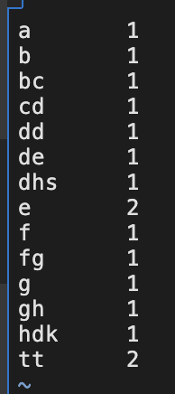
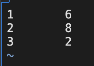

## 并行计算 Lab4 实验报告

**PB20000215 丁程**

本实验为Hadoop的部署以及基于Java MapReduce框架的Lengthcount代码编写.

首先是Hadoop的部署，部署在本人的阿里云服务器上，操作系统为CentOS.
使用
```bash
yum install -y java-1.8.0-openjdk*
```
安装jdk
之后使用export JAVA_HOME = xxx来将JAVA路径添加到环境变量

在确定完本机有ssh和sshd以后，使用如下shell脚本来配置无密码ssh:
```sh
mkdir /var/run/sshd

ssh-keygen -t rsa -P '' -f ~/.ssh/id_rsa
cat ~/.ssh/id_rsa.pub >> ~/.ssh/authorized_keys
chmod 0600 ~/.ssh/authorized_keys

sed -i 's/PermitRootLogin without-password/PermitRootLogin yes/' /etc/ssh/sshd_config
```
之后按照部署文档配置环境以及xml文件。
按照部署文档一步步做，最终生成output文件part-r-00000:

对比发现结果正确。

为了编写Lengthcount,在给出的Wordcount程序的基础上做如下修改即可：
将
```java
public void map(Object key, Text value, Context context
                ) throws IOException, InterruptedException {
      StringTokenizer itr = new 
        StringTokenizer(value.toString());
      while (itr.hasMoreTokens()) {
        word.set(itr.nextToken());
        context.write(word, one);
      }
    }
```
改为
```java
public void map(Object key, Text value, Context context
                ) throws IOException, InterruptedException {
        StringTokenizer itr = new 
            StringTokenizer(value.toString());
        while (itr.hasMoreTokens()) {
          word.set(String.valueOf(itr.nextToken().length()));
          context.write(word, one);
        }
      }
```
在原本的Wordcount中，map函数将词itr.nextToken()映射到自身，这是为了计算相同的词的个数。相同的词会被映射到同样的字符串上。
在Lengthcount中，将词itr.nextToken()映射到词长itr.nextToken().length()，这样相同词长的词就会映射到同样的数上，在Reduce的时候就会计数。同时，为了避免接口类型出错，使用String.valueOf()将原本的integer类型转换为和原代码一样的string类型。
在仿照部署文档提交并运行任务后，得到output/part-r-00000，使用
```bash
hadoop fs -get /user/Iris/lengthcount/output/part-r-00000 ./
```
将HDFS中的文件get下来查看：

和PPT对照得到相同的结果，结果正确。

至此，本次实验结束。
本次实验主要内容为Hadoop的部署以及MapReduce框架的理解和应用。MapReduce是Google提出的经典的大数据处理框架，在分布式场景下有着很好的应用。本次实验按照给出的部署文档即可正常部署。在理解了MapReduce框架后，即可对给出的Wordcount代码进行修改得到Lengthcount。经过本次实验，对分布式系统的部署以及MapReduce框架有了更为深入的理解。
